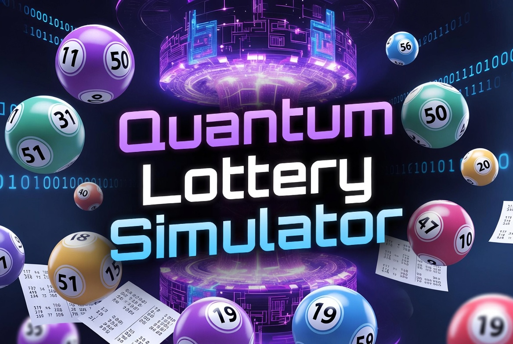

# 🧪 Quantum Lottery Simulator

**Simulador Quântico de Loterias usando Google Cirq**

Um projeto educativo que utiliza **computação quântica** (superposição de qubits) para gerar números de loteria de forma aleatória e divertida.

## 📖 Sobre o Projeto

Este projeto demonstra na prática conceitos básicos de computação quântica:
- Criação e manipulação de qubits
- Porta Hadamard (superposição)
- Medição de estados quânticos
- Conversão de resultados quânticos em números de loteria

## ✨ Funcionalidades

- ✅ Gerador de números usando qubits
- ✅ 10 Jogos da **Lotofácil**
- ✅ 5 Jogos da **Mega-Sena**
- ✅ Gráfico de distribuição dos números
- ✅ Código limpo e bem comentado

## 🛠️ Tecnologias Utilizadas

- **Python**
- **Cirq** (Framework de Computação Quântica do Google)
- **Matplotlib** (Visualizações)
- **Google Colab**

## 📊 Como Executar

1. Clique aqui → 
2. Execute todas as células (`Shift + Enter`)

## 🎯 Objetivo

Mostrar de forma prática e divertida como a computação quântica pode ser usada em aplicações reais (mesmo que simuladas).

---

**Feito por Santiago**  
Projeto de Introdução à Computação Quântica - Maio/2026
Projeto de introdução à Computação Quântica - 2026
